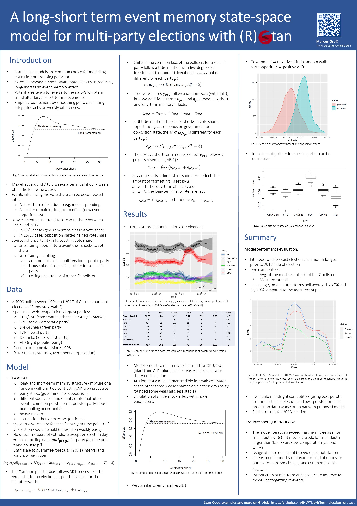

2021 German Federal Election Forecasting Model
===============================================

With the Bundestagswahl approaching in September 2021, [INWT-Statistics Lab](https://www.inwt-statistics.com/home.html) aims to build a comprehensive model that forecasts the [German federal election](https://www.dw.com/en/how-does-the-german-general-election-work/a-37805756) (_Bundestagswahl_) outcomes. This repository provides the code of our election forecast predictions using a dynamic multilevel Bayesian model written in _R_ and _Stan_. We believe that our model brings these advantages:

- Our model could be better than depending solely on polls in predicting the outcome of the election
- Make an accurate statement about the uncertainty of our forecasts
- Optimize prediction through expert opinions, the model can provide information about the likelihood of government coalitions or government participation of individual parties

How does the model work?
========================
### The Bayesian State-Space-Modell provides forecast with uncertainties through these steps:

1. Simulate a large number of possible outcomes of the Bundestag election
2. Sources of uncertainty that are taken into account in the model:
   - Future events
   - Sampling errors due to the limited number of people surveyed per survey
   - Considers the distortion of election polls due to inaccurate mapping of the electoral population (representativeness), non-response or incorrect information from survey participants
3. Maintain predictive accuracy by:
   - Surveying results are adjusted for &quot;house effects&quot; of the surveying institutes
   - Modeling a long and short-term memory of the electorate potentials
   - Considering &#39;opposition&#39; or government status of the parties (opposition parties tend to gain, government parties tend to lose)

### Defining uncertainty: 
categorized sources of uncertainty in forecasting vote share into two types:
1. Uncertainty about the future events, i.e. shocks to vote share
2. Uncertainty in polling:
   - common bias of all pollsters for a specific party
   - house bias of a specific pollster for a specific party
   - polling uncertainty of a specific pollster

2017 Model Description
=======================
Marcus Groß&#39;s in 2017 built a [state-space model](http://www.scholarpedia.org/article/State_space_model) for the federal Bundestag election, which is a common choice for modelling voting intentions using poll data. We foresee these advantages are what make our model unique:
- The model is different from conventional polls: not only a forecast for a hypothetical election next Sunday (weekly forecasts), but also for the election itself.
- Through multiple simulations of the Bundestag election results, realistic uncertainties for our forecasts can be quantified.
- We can provide more accurate forecasts for certain events relating to the outcome of the election, such as the participation of individual parliamentary groups in government.
- **Model Performance:** the forecasting quality of our model is about 10-15% better than a simple averaging of the surveys of the past week (checked by backtesting at the last elections).

For more detailed coverage of our 2017 forecast, please refer to these articles on the [_Die Welt_](https://www.welt.de/politik/deutschland/article163306730/Diese-Spezial-Analyse-sieht-einen-klaren-Wahlsieger-in-Deutschland.html), the [_New York Times_](https://www.nytimes.com/2017/09/18/world/europe/germany-election-martin-schulz.html), and [Sueddeutsche](https://www.sueddeutsche.de/digital/wahlprognosen-der-naechste-bundeskanzler-wird-1.3584122)_._

2021 Model Description
======================
Improving on our [2017 Bundestagswahl forecasting](https://www.inwt-statistics.de/blog-artikel-lesen/wahlprognose-fuer-die-bundestagswahl-2017.html), our updated new model this year uses a _Long-short term memory state-space model for election forecasting_[(Groß, 2019)](https://zenodo.org/record/3697270).
- Instead of several individual models for different aspects, this year we have a holistic, self-contained model
- Faster response to short-term trends in voter sentiment
- Improved modeling of medium and long-term trends rendering now more meaningful interpretation
- Consideration of government status (opposition / government) as an influencing factor in future events
- More precise modeling of house effects of the institutes and interactions between parties

Data Sources
=====

### Our model uses three different types of input data

1. **Polling data:** the data amounts to more than 4,000 polls from eight different pollsters between November 1st, 1994, through the current date for the German federal election (&quot;Bundestagswahl&quot;). We scrape this data from [www.wahlrecht.de](https://www.wahlrecht.de/umfragen/index.htm), which collects all available polling data and is frequently updated.

1. **Election outcome data**: the model considers data concerning respective parties forming the government and opposition available for all elections since 1998. For a given election result usually multiple coalitions are conceivable and the government is formed independent from the voters. To answer questions like &quot;How large is the probability that the government consists of a coalition of parties A and B&quot;, &quot;What is the probability that person X is going to be chancellor / prime minister&quot; or &quot;How likely is it that party C is part of the government&quot;, the incorporation of an expert poll is proposed. Data is available for the six large parties: CDU/CSU, SPD, Die Grünen, FDP, Die Linke and AfD.

1. **Expert interviews** : the model combines the results with expert interviews, gathering expert opinion regarding coalition preferences. Experts are defined as people associated and familiar with politics, e.g. active in politics, working for a party or a politics-related institution or having an academic degree in political science. A list of potential coalitions was given to the experts, and the experts are given the task to rank these coalitions under the premise to do this independently to the potential election result. Up to date [21.01.2021], the model considers 16 interview responses with 12 rankings, see list [here](https://github.com/INWTlab/lsTerm-election-forecast/blob/master/data/Koalitionen_read.csv). The interview process provides critical priors for our Bayesian workflow. For more detailed methodology, please read the [methods](https://github.com/INWTlab/lsTerm-election-forecast/blob/master/Notebook/notebook.pdf) section.

**Model Performance:** A forecast can never – and should never – claim to be prophetic. Forecasts make statements about future conditions, and are therefore invariably coupled with uncertainty.

How to use IsTermElectionForecast
=================================
`dataDE <- loadDataDE(predDate)` 
> `returns` list of poll data, elections data, and coalition data 
- `predDate`:: the date of running the model e.g. as.Date(&quot;yyyy-mm-dd&quot;)

`dataPrep <- preparePollData(dataDE$pollData, dataDE$Elections, predDate)`
> `returns` a list of cleaned data sets ready for modeling
- `dataDE$pollData` :: contains the imported polls data from the directory
- `dataDE$Elections` :: contains the historical German elections results data
- `predDate` :: date of running the model

`modelResults <- compileRunModel(dataPrep$modelData)`
> `returns` a list of stan models after sampling
- `dataPrep$modelData` :: formatted cleaned data input resulted from previous `preparePollData` function

`plotForecast <- plotElectionData(modelResults, dataPrep, predDate, dataDE$pollData, start = "2016-01-01")`
> `Returns` list of _ggplot_ graph, and JSON file output 
- `modelResults` :: a list of model output of the function _compileRunModel()_
- `dataPrep` :: output of the function _preparePollData()_
- `predDate` :: date of running the model
- `dataDE$pollData` :: contains the imported polls data from the directory
- `start` :: date format &quot;yyyy-mm-dd&quot;

`fact_forecast <- getForecastTable(modelResults, dataPrep, predDate)`
> `Returns` a table that contains each political party prediction forecasts
- `modelResults`: a list of model output of the function _compileRunModel()_
- `dataPrep`:: list of cleaned data sets ready for modeling from _preparePollData()_
- `predDate`:: date of running the model, as.Date(&quot;yyyy-mm-dd&quot;)

`fact_event_prob <- eventsDE(modelResults, dataPrep, predDate)`
> `Returns` a dataframe of events taking in consideration election forecasts
- `modelResults`: a list of model output of the function _compileRunModel()_
- `dataPrep`:: list of cleaned data sets ready for modeling from _preparePollData()_
- `predDate`:: date of running the model, as.Date(&quot;yyyy-mm-dd&quot;)

fact_coalition_prob <- koalitionDE(dataDE$Koalitionen, modelResults, dataPrep, predDate)
> `Returns` dataframe of political party coalitions possible estimates 
- `dataDE$Koalitionen`:: dataframe from function _loadDataDE(predDate)_
- `modelResults`:: a list of model output of the function _compileRunModel()_
- `dataPrep`:: list of cleaned data sets ready for modeling from _preparePollData()_
- `predDate`:: date of running the model, as.Date(&quot;yyyy-mm-dd&quot;)

fact_part_of_government <- partOfGovernmentDE(fact_coalition_prob, predDate)
> `Returns` dataframe of sum estimates of the different possibilities of coalitions
- `fact_coalition_prob` :: dataframe that contains party coalition estimates
- `predDate` :: date of running the model, as.Date(&quot;yyyy-mm-dd&quot;)

# Repository elements

- Notebook: step by step tutorial into how to forecast the German election in R + Stan
- Poster
- R\_scripts
- data
- model\_results
- stan\_models

Licence: [CC BY-NC-SA 4.0](https://creativecommons.org/licenses/by-nc-sa/4.0/legalcode)
=========================================================================================

lsTerm-election-forecast Poster
================================
A long-short term event memory state-space model for multi-party elections

