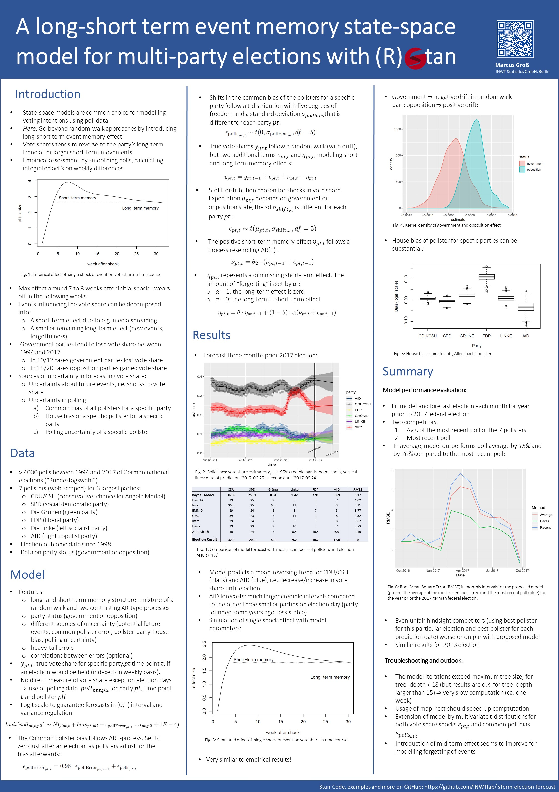

# Election forecast

A long-short term event memory state-space model for multi-party elections

## Most important scripts
- `inst/RScripts/scriptMulti.R`: runs model to predict the votes, based on survey data
- `inst/RScripts/coalition_model.R`: runs model to derive probability of coalitions, based on past coalitions in federal states

## Conference poster

